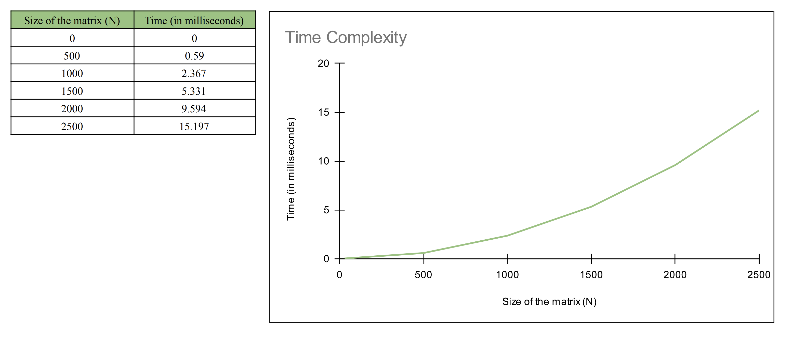
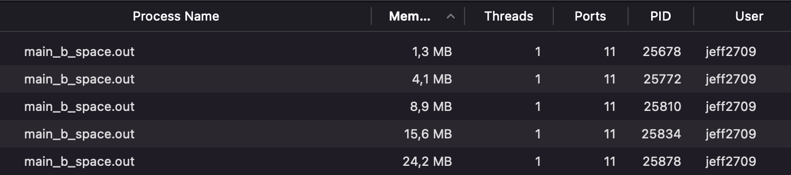
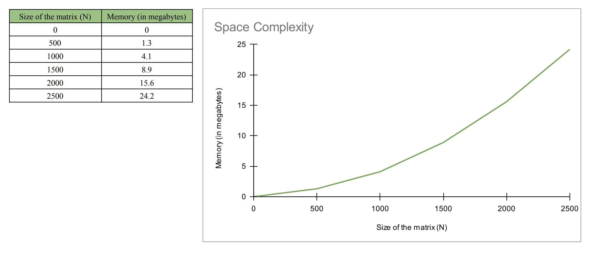

# Matrix Vector Multiplication 

In this assignment, I will be analyzing the time and space complexity of the matrix vector multiplication as well as testing whether my function of the matrix vector mulplication works as expected. 

# Testing

How to Run:
```bash
make test
```

The output would be: 
```
Test #1: 
Actual V[0] = 32; Expected V[0] = 32
Actual V[1] = 31; Expected V[1] = 31
Actual V[2] = 39; Expected V[2] = 39

Test #2:
Actual V[0] = 109; Expected V[0] = 109
Actual V[1] = 49; Expected V[1] = 49
Actual V[2] = 69; Expected V[2] = 69

Test #3:
Actual V[0] = 56; Expected V[0] = 56
Actual V[1] = 89; Expected V[1] = 89
Actual V[2] = 101; Expected V[2] = 101
```

I created a new function called `test_multiply_vector_matrix` in mylib.c that takes 4 inputs `M`, `v`, `N`, `vector_expected`. After that, I implement it to test my `multiply_vector_matrix()` function using some of the input matrices and vectors that were given as the test cases, and I compared the results produce by that function with the expected results. In this case, I provided 3 test cases with `N=3`, and the output came out that the matrix multpication vector result generated by my `multiply_vector_matrix()` function matches with the expected / manually multiplication result. It means that the `multiply_vector_matrix()` function works correctly.

# Benchmark 

## Time Complexity 

How to Run: 

```
make time
```

The output would be:
```
Time elapsed with N = 10000 : 0.249554 s
```

This indicates that, with N = 10000, it will take 0.249554 s to compute the multiplication of the N x N matrix to the N-vector.

This graph illustrates the time required as the N size increases.



## Space Complexity 

How to Run: 

```bash
make space
```

The result can be seen through activity monitor / task manager (N = 500)


This image below illustrates the time required as the N size increases (N = 500, N = 1000, N = 1500, N = 2000, N = 2500)



This graph below illustrates the time required as the N size increases. (N = 500, N = 1000, N = 1500, N = 2000, N = 2500)




